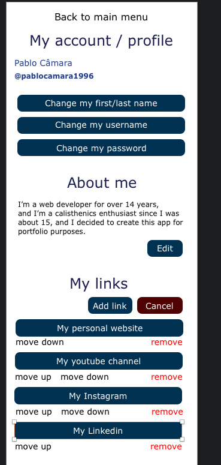

## About "Chat Rooms" (this web app)

I'm creating this project mainly as portfolio and as a way of exploring certain technologies and refreshing my mind with some content for later use in a professional environment.

I have created an MVP / Prototype / whatever you call it, in Sketch,
and I have created the views below that I will be implementing:

- Login
    - 

- Register
    -  

- Main menu
    - 

- List of chat rooms
    - 

- Chat room
    - 

- List of users
    - 

- Users profile page | My User profile / account page
    - 

Inside those views I have different components with different states that will make up the views.

## Tech stack

- Laravel 10
- React
- composer package "beyondcode/laravel-websockets" for server side websockets
- npm package "laravel-echo" for client side of websockets
