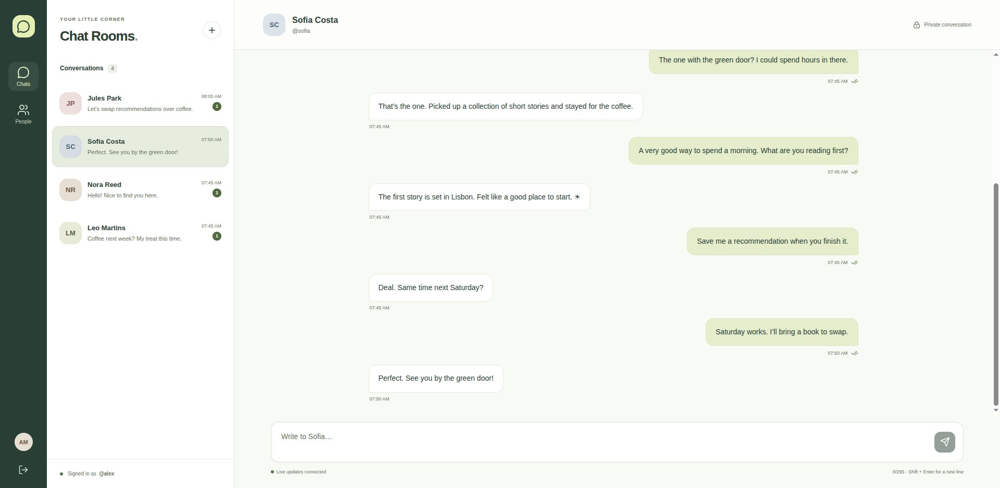
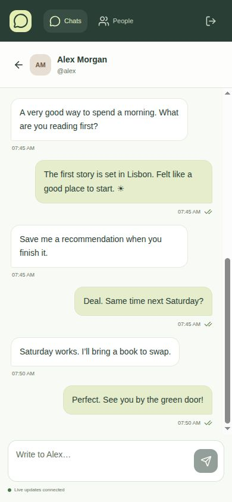
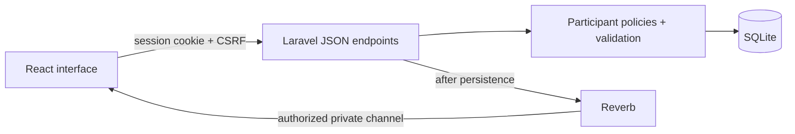

# Chat Rooms

A focused, responsive messaging application built with **Laravel 13, React 19 and Laravel Reverb**. Find people, manage contact requests and have private one-to-one conversations with live delivery and read receipts.



## Try it locally

You need Docker with the Compose plugin. PHP, Composer, Node and SQLite run in containers.

```sh
git clone https://github.com/Pablo-Camara/Chat-Rooms.git
cd Chat-Rooms
./scripts/setup.sh

docker compose run --rm app php artisan db:seed --class=DemoSeeder
```

Open **[localhost:8088](http://localhost:8088)**. Sign in as `alex` or `sofia` using `hello-there-demo`.

All demo people and conversations are fictional. Seeding is optional, only works in `local`/`testing`, and refuses to overwrite an existing account database. Without it, use **Create an account**.

To test two people in one browser, sign in as Alex at `localhost:8088` and Sofia at `127.0.0.1:8088`. These hostnames use independent cookies. Alternatively use a separate browser profile. Open the same conversation and send a message.

The setup script preserves an existing `.env`, application key and database. It installs locked dependencies, runs migrations, builds assets and starts the app and socket server. It never resets or reseeds your data. Both published ports bind to loopback.

### Configuration

Copy `.env.example` before running setup if you want different ports. Update these together:

| Setting | Default | Purpose |
| --- | --- | --- |
| `APP_URL`, `APP_PORT` | `http://localhost:8088`, `8088` | Browser application URL and published port |
| `SANCTUM_STATEFUL_DOMAINS` | Both local hostnames with port 8088 | Origins allowed to use session authentication |
| `REVERB_PUBLIC_PORT`, `VITE_REVERB_PORT` | `8089` | Published and browser WebSocket ports |
| `VITE_REVERB_HOST` | `localhost` | Host reachable from the browser |
| `REVERB_HOST`, `REVERB_PORT` | `reverb`, `8080` | Internal application-to-socket connection |
| `DB_DATABASE` | `/app/database/database.sqlite` | SQLite database inside the container |

Rebuild assets after changing `VITE_*` settings. For native PHP development, set `DB_DATABASE` to your host's absolute path instead. The local Compose server is for development; it is not a production web-server configuration.

```sh
docker compose logs --tail 100
docker compose down        # stops this stack; preserves files and the SQLite database
```

On Linux, set `LOCAL_UID=$(id -u)` and `LOCAL_GID=$(id -g)` when invoking Compose directly if your user ID is not 1000. The setup script handles this automatically. If Docker has exhausted its address pools, configure an unused subnet in a local Compose override; leave unrelated projects' networks alone.

## The application

- **Accounts:** registration, sign-in and sign-out with HttpOnly session cookies and CSRF protection.
- **Conversations:** private participants, chronological messages, earlier-history pagination and unread counts.
- **Live delivery:** authenticated Reverb channels and read receipts. A five-second refresh fallback keeps an open conversation useful if the socket disconnects; hidden tabs pause refreshes.
- **People:** paginated prefix search, contact requests, accept/decline/cancel and removal of contacts. Any registered person can start a direct conversation; contact acceptance is not required.
- **Reliable composition:** failed sends keep the draft, retries reuse an idempotency key, and drafts survive navigation between conversations during the current session. Reloading or signing out clears drafts.
- **Responsive interface:** desktop conversation list, mobile back navigation, labels, keyboard focus, loading/empty/error states and reduced-motion support. Enter sends; Shift+Enter adds a line.

The app deliberately focuses on text conversations. It does not implement group rooms, attachments, account recovery, blocking/reporting or end-to-end encryption. Messages are stored in the application database and are accessible to its operator.



## Engineering decisions


```mermaid
flowchart LR
    react[React interface] -->|session cookie + CSRF| laravel[Laravel JSON endpoints]
    laravel --> policy[Participant policies + validation]
    policy --> db[(SQLite)]
    laravel -->|after persistence| reverb[Reverb]
    reverb -->|authorized private channel| react
```

**Authorization is checked at every boundary.** Message reads, writes and read receipts use `ChatRoomPolicy`; socket subscriptions independently check the same participants. Public user responses use explicit resources instead of serializing entire models. Legacy bearer tokens are no longer accepted by the browser API.

**Uniqueness belongs in the database.** Canonical participant-pair keys prevent duplicate conversations and contact requests. Per-room sender/client-ID constraints make message retries idempotent. Messages use an indexed ID cursor with a bounded page size; eager loading avoids per-row queries in conversation lists.

**Persistence comes before notification.** The message and conversation timestamp commit in a transaction before broadcast. A socket outage cannot roll back a saved message or make a retry create another copy. The UI merges messages by ID, including read-receipt updates.

**Small, explicit boundaries.** Controllers handle HTTP contracts; resources whitelist response fields; policies handle access; the conversation service owns pair creation. React separates authentication, contacts, conversations, transport and shared controls. Comments explain decisions rather than restating code.

**Operationally modest.** SQLite and synchronous broadcasting keep the demo easy to run. The inbox refreshes every five seconds; contact requests every ten. This is not a load-tested high-volume chat service. A larger deployment needs measured capacity planning, a production web server, trusted HTTPS/WSS, backups, shared session/cache storage when scaling, and an appropriate database/queue strategy.

## Verification

```sh
# Backend behavior, authorization, validation, CSRF and legacy-token rejection
docker compose run --rm app php artisan test

# PHP formatting and frontend behavior
docker compose run --rm app vendor/bin/pint --test
docker compose run --rm node npm test
docker compose run --rm node npm run build

# Dependency advisories
docker compose run --rm app composer audit
docker compose run --rm node npm audit --omit=dev
```

To verify actual WebSocket delivery after starting and demo-seeding the application, use Node 24 on the host:

```sh
npm ci
node scripts/check-realtime.mjs
```

That integration script signs in two independent demo sessions, authorizes a private channel and verifies a saved message arrives over the socket **without polling**. It adds one message to the Alex/Jules demo conversation. Set `APP_PORT` and `REVERB_PUBLIC_PORT` when using custom ports.

[GitHub Actions](.github/workflows/verify.yml) runs setup, backend and frontend tests, formatting, dependency checks, asset compilation and the real WebSocket check. Browser QA additionally covers independent sessions, message delivery/read receipts and desktop/mobile layouts. Screenshots here are captures of the running application, not design mockups.

## Upgrading the original project

The Git history and original database migrations remain. This update moves Laravel 10 to 13, replaces the browser's persistent bearer token with a session cookie, removes tracked deployment environment files, and replaces the older endpoint/UI contracts. Existing custom clients need updating; inspect `routes/api.php` for the new endpoints.

Back up an existing database before migration. The new pair-uniqueness migration refuses ambiguous duplicate conversation/contact pairs rather than silently merging or deleting history. Consolidate those records deliberately before rerunning it. Old notification/membership/token tables are retained for migration compatibility but are not used by the refreshed interface.

Environment files removed from the working tree still exist in Git history. Rotate any historical credential that was ever valid. Newly generated local keys are ignored by Git; production secrets must be provisioned separately. Never deploy the demo accounts or local Compose server publicly.

## License

The project retains its original MIT package licence. Third-party dependencies retain their respective licences.
