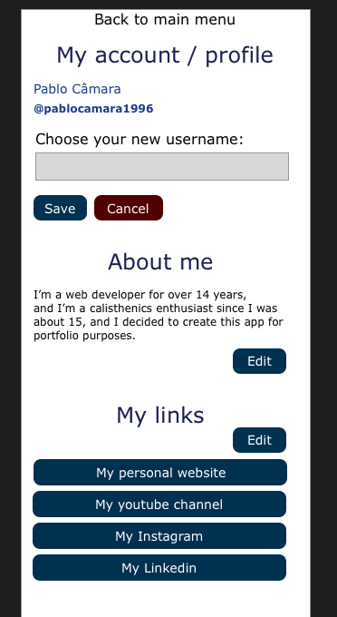

## Tech stack

- Laravel 10
- React
- composer package "beyondcode/laravel-websockets" for server side websockets
- npm package "laravel-echo" for client side of websockets

## About "Chat Rooms" (this web app)

I'm creating this project mainly as portfolio and as a way of exploring certain technologies and refreshing my mind with some content for later use in a professional environment.

I have created an MVP / Prototype / whatever you call it, in Sketch,
and I have created the views below that I will be implementing..
Inside those views I will have different reusable components with different states that will make up the views.

You can check screenshot images below:

- Login

- Register

- Main menu

- List of chat rooms

- Chat room

- List of users

- User profile page (Not added to friend list)

- User profile page (User added to friend list)

- My User Account / Profile

- My User Account / Profile - Edit first/last name

- My User Account / Profile - Change username

- My User Account / Profile - Change password

- My User Account / Profile - Edit about me

- My User Account / Profile - Add / Edit Link

